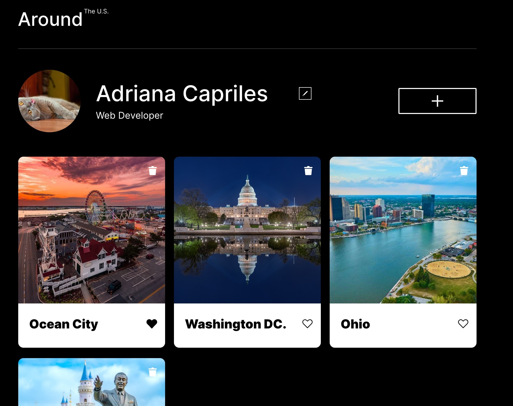

🌎 Around The U.S.

Interactive web application developed as part of the TripleTen Web Development Bootcamp.

This project allows users to manage a personal profile and a collection of image cards through a REST API. Users can create, edit, like, and delete cards while keeping data synchronized with a remote server.

📸 Project Preview

⸻

🚀 Features

* Edit user profile information
* Update profile avatar
* Create new image cards
* Delete cards with confirmation modal
* Like and unlike cards
* View images in fullscreen modal
* Form validation with real-time feedback
* Persistent data storage through REST API integration
* Responsive design for multiple screen sizes

⸻

🛠️ Technologies

* TypeScript
* JavaScript (ES6+)
* HTML5
* CSS3
* BEM Methodology
* Object-Oriented Programming (OOP)
* REST API
* Fetch API
* Async/Await
* ES Modules

⸻

🧠 Key Concepts Applied

* DOM Manipulation
* Event Handling
* Form Validation
* Component-Based Architecture
* API Integration
* Promise.all()
* Class Inheritance
* Encapsulation
* Modular Code Organization
* Type Safety with TypeScript

⸻

💡 Challenges & Learnings

One of the main challenges of this project was organizing the application using Object-Oriented Programming principles and a modular architecture while maintaining clean and scalable code.

Through this project, I strengthened my understanding of:

* TypeScript development
* API integration
* Asynchronous JavaScript
* OOP design patterns
* Professional frontend workflows
* State management and user interactions

⸻

👩‍💻 Author

Adriana Capriles Rivera

Junior Web Developer | TripleTen Student

📍 Virginia, USA

🔗 LinkedIn: https://www.linkedin.com/in/adriana-capriles-rivera/

🔗 GitHub: https://github.com/AdriCR92
